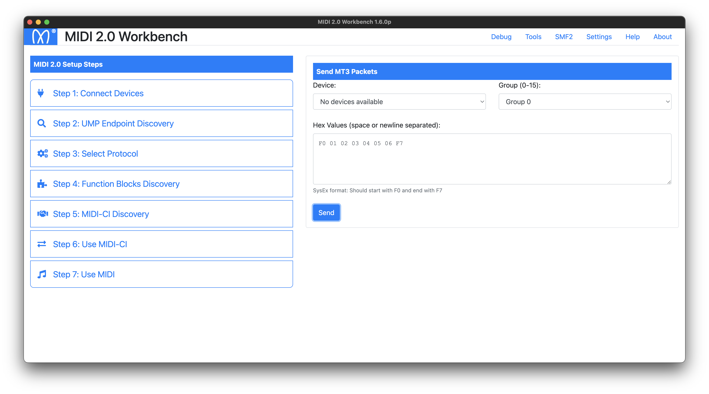

# MIDI 2.0 Workbench modified for testing


The MIDI 2.0 Workbench is a free tool from MIDI Association Members to help developers develop, debug (and deploy) MIDI 2.0 Applications and Devices. It runs on Windows, Mac and Linux.
The Workbench connects to your device or software, to test various MIDI 2.0 implementation features against the currently released specifications.

## How to build

```
yarn
yarn run build
rm -rf node_modules/midi
yarn add midi 
```

## How to run

```
yarn start
```
